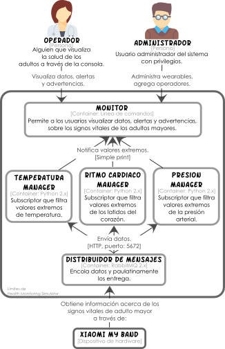

# Arquitecturas Publica - Suscribe

## Tarea 1

### Prerequisitos

Antes de ejecutar el código de la tarea 1 se requiere instales las librerias de Python indicadas en el archivo [requirements.txt]  

### Ejecutar simulador de la tarea 1

La tarea 1 cuenta con un simulador que ofrece una situación más realista acerca de una arquitectura Publica - Suscribe. Para ejecutar el simulador sigue los siguientes pasos.  
1. Abrir terminal.  
2. Clonar el repositorio:   `git clone https://github.com/arqdesw-curso/Arquitecturas-Publica-Suscribe.git`  
3. Ingresar a la carpeta que descargamos:   `cd Arquitecturas-Publica-Suscribe/`  
5. Ejecutar el simulador: `python simulador.py`  

El simulador implementa una versión funcional del Sistema de Monitore de Adultos Mayores (SMAM). A continuación se muestra un diagrama de contenedores del SMAM.

## Versión

2.0.2 - Septiembre 2017

## Autores

* **Perla Velasco**
* **Yonathan Martínez**
